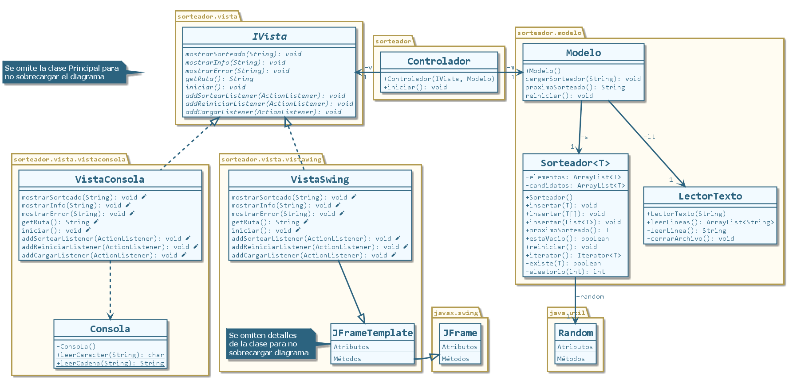

# Sorteador MVC en Java

## Descripción

Aplicación que permite sortear líneas de texto obtenidas vía un archivo de texto (.txt).
La interfaz de usuario puede seleccionarse al principio de la ejecución del programa, optando por manejar la aplicación vía interfaz gráfica (`VistaSwing`) o por consola (`VistaConsola`).

Este repositorio permite mostrar la base de la arquitectura MVC (Modelo-Vista-Controlador), en la cual el **Controlador** oficia de intermediario entre la lógica de la aplicación (**Modelo**) y las acciones del usuario (**Vista**).

## Diagrama de clases

Proyecto realizado con NetBeans 8.2. Compatible con Eclipse.